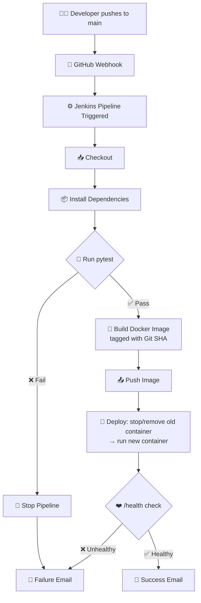

# 🚀 Flask + MongoDB CI/CD Pipeline — Jenkins Edition

**Automated test → build → deploy → verify → notify pipeline for a Python Flask application**


>  **CI/CD Pipeline**
> Built and validated end‑to‑end: source control → automated testing → containerization → deployment → health verification → email notification.

---

## 📋 Table of Contents

1. [Objective](#-objective)
2. [Architecture](#-architecture)
3. [Tech Stack](#-tech-stack)
4. [Repository Structure](#-repository-structure)
5. [Prerequisites](#-prerequisites)
6. [Getting Started](#-getting-started)
7. [Pipeline Stages](#-pipeline-stages-in-detail)
8. [Email Notifications](#-email-notifications)
9. [Secrets Management](#-secrets-management)
10. [Screenshots & Evidence](#-screenshots--evidence)
11. [Grading Rubric Compliance](#-grading-rubric-compliance)
12. [Environment Note: Local vs. AWS](#-environment-note-local-vs-aws)
13. [Reproducing a Deployment Manually](#-reproducing-a-deployment-manually)
14. [Author](#-author)

---

## 🎯 Objective

This repository implements a fully automated CI/CD pipeline for a Python **Flask + MongoDB** web application. Every push to `main` triggers a Jenkins pipeline that:

- ✅ Installs dependencies and runs the **pytest** suite — a failing test **gates** the pipeline (no build/deploy happens)
- 🏗️ Builds a **Docker image**, tagged with the **Git commit SHA** (never just `latest`) for full traceability
- 📦 Publishes the image
- 🔁 **Deploys** by replacing the currently running container — not a fresh install every time
- ❤️ **Verifies** the deployment with a `/health` endpoint check — this is the true success/failure gate
- 📧 Sends a **customized email** reporting the outcome, with different content for success vs. failure

---

## 🏗️ Architecture



**Flow summary:** `Push → Checkout → Install → Test (gate) → Build (SHA‑tagged) → Push image → Deploy (swap container) → Verify (health gate) → Notify`

---

## 🧰 Tech Stack

| Layer | Technology |
|---|---|
| Application | Python 3.11, Flask |
| Database | MongoDB (Docker container) |
| Testing | pytest |
| Containerization | Docker |
| CI/CD Orchestration | Jenkins (Pipeline as Code — `Jenkinsfile`) |
| Notifications | Jenkins Email Extension (`emailext`), Gmail SMTP |
| Trigger | GitHub Webhook (`push` to `main`) |

---

## 📁 Repository Structure

```text
.
├── app.py                  # Flask application (incl. /health route)
├── test_app.py             # pytest suite — success & failure cases
├── requirements.txt        # Python dependencies
├── Dockerfile              # Container image definition
├── .dockerignore
├── Jenkinsfile             # Pipeline definition (Checkout→Notify)
├── .gitignore
└── README.md                # You are here 📍
```

---

## ✅ Prerequisites

| Requirement | Purpose |
|---|---|
| Docker installed & running | Builds and runs the application + database containers |
| Jenkins with **Docker Pipeline**, **Email Extension**, and **GitHub Integration** plugins | Runs and orchestrates the pipeline |
| A reachable Jenkins URL for the GitHub webhook | Lets GitHub trigger builds automatically on push |
| Jenkins credentials configured (see [Secrets Management](#-secrets-management)) | Keeps DB URI, SMTP, and Git tokens out of the repo |
| Gmail App Password (or your SMTP provider of choice) | Sends success/failure notification emails |

---

## 🏁 Getting Started

<table>
<tr><td>

```bash
# 1️⃣ Clone your fork
git clone https://github.com/<your-username>/flask_Practice.git
cd flask_Practice

# 2️⃣ Create a virtual environment
python3 -m venv venv
source venv/bin/activate

# 3️⃣ Install dependencies
pip install -r requirements.txt

# 4️⃣ Run the test suite locally
pytest -v

# 5️⃣ Build the Docker image
docker build -t flask-student-app:local .
```
</td></tr>
</table>
------------------


## Forked Repo


-----------------
**Git Clone


----------------

## Added matching pytest case 

```
# test_app.py
def test_health_ok(client):
    resp = client.get("/health")
    assert resp.status_code in (200, 503)   # route responds either way
    assert "status" in resp.get_json()


```

-------------

Dockerfile & .dockerignore

```
Dockerfile
FROM python:3.11-slim
 
WORKDIR /app
 
# Install dependencies first so Docker can cache this layer
COPY requirements.txt .
RUN pip install --no-cache-dir -r requirements.txt
 
# Now copy the rest of the app
COPY . .
 
EXPOSE 5000
 
# Gunicorn for a production-grade WSGI server instead of Flask's dev server
CMD ["gunicorn", "--bind", "0.0.0.0:5000", "--workers", "2", "app:app"]

```

-------------

.dockerignore

```
__pycache__/
*.pyc
.git
.gitignore
.env
.env.example
venv/
*.md
tests/
.pytest_cache/

```

----------

## Create the ECR repository


```
1.AWS Console → search "ECR" → Elastic Container Registry.
2.Repositories → Create repository.
3.Visibility: Private. Name: flask-practice (or match your repo name).
3.Leave "Tag immutability" off during dev; scan-on-push can stay enabled — it's free and useful.
4.Create repository, then copy the URI shown

```

---------

## Launch the EC2 instances 

One instance runs Jenkins itself (the controller). The other is the deployment target the app actually runs on. Launch both the same way, with different names and security groups.

## 🖥️ EC2 Instances Overview

| Instance   | Name                | Type                          | Purpose                                      |
|------------|---------------------|-------------------------------|----------------------------------------------|
| Controller | jenkins-controller  | t2.medium / t3.medium         | Runs Jenkins, builds images, triggers deploys |
| App target | flask-practice-app  | t2.micro / t3.micro (free-tier eligible) | Runs the deployed Flask container |


## 🔐 Security Group Rules

| Type       | Port | Source       | Purpose                                      |
|------------|------|--------------|----------------------------------------------|
| SSH        | 22   | Your IP /32  | You SSH in to install Jenkins and troubleshoot |
| Custom TCP | 8080 | Your IP /32 (or a small trusted range) | Jenkins web UI access |

----------

Jenkins-Controller instance 


------------

Flask-practice app Instance 


------------
 # Installed  Docker on both instances


 ```
# Update package index
sudo apt-get update -y

# Install Docker and AWS CLI
sudo apt-get install -y docker.io awscli

# Enable and start Docker service
sudo systemctl enable docker --now

# Add the ubuntu user to the docker group (so you can run docker without sudo)
sudo usermod -aG docker ubuntu

```
-------

Java


-----

Docker

---------


----------

---------

## IAM role for ECR pull (app target)

## 🔑 Authentication & Access Approach

| Approach                                | How it works                                                                 | Used in this guide |
|-----------------------------------------|-------------------------------------------------------------------------------|--------------------|
| EC2 instance role on `flask-practice-app` | Lets the EC2 box pull from ECR without storing AWS keys locally               | ✅ Yes — for the `docker pull` during deploy |
| IAM user + access keys (Jenkins Credentials) | Jenkins authenticates to AWS directly to push the image to ECR                | ✅ Yes — for the Build/Push stages |

------


------


-----


-----

## AM user for Jenkins (push access)


-----


----


----

## Install & Configure Jenkins


---


---
-----

## Configure the SMTP server for emailext in Jenkins


```
Manage Jenkins → System → scroll to Extended E-mail Notification.
SMTP server: smtp.gmail.com. SMTP Port: 465. Check Use SSL.
Advanced → check Use SMTP Authentication → enter your Gmail address and the App Password from Section 9.
Default Content Type: HTML. Default Recipients: your notification email.
Save, then use the built-in "test configuration" button to confirm a test email arrives before writing the pipeline.

```

---------


----------
## Configure Jenkins Credentials

------


## 🔒 Credentials Setup

| Credential ID | Kind                  | Value                                                                 |
|---------------|-----------------------|-----------------------------------------------------------------------|
| aws-creds     | AWS Credentials       | Access Key ID / Secret Access Key from the `jenkins-cicd` IAM user     |
| ec2-ssh-key   | SSH Username + Key    | Username: `ubuntu` · Key: full contents of `flask-practice-key.pem`    |
| mongo-uri     | Secret text           | Your MongoDB Atlas connection string                                   |
| ecr-registry  | Secret text           | `<account-id>.dkr.ecr.<region>.amazonaws.com`                          |
| ecr-repo-name | Secret text           | e.g. `flask-practice`                                                  |
| ec2-app-host  | Secret text           | Public IP or DNS of `flask-practice-app`                               |
| notify-email  | Secret text           | Email address where success/failure notifications should be sent       |


---------


----------
## Add the webhook on GitHub

---------------------


---------
## Jenkins Pipeline 
----------

???????

```

```

---------

----------

```

```

---------

----------

```

```

---------

----------

```

```

---------
----------

```

```

---------
----------

```

```

---------
----------

```

```

---------


## 🔄 Pipeline Stages in Detail

The `Jenkinsfile` implements every stage below, in this exact order, mapped to the assignment requirements:

### 1️⃣ Checkout
Pulls the latest source from the `main` branch on every triggered build.

### 2️⃣ Install Dependencies
```bash
python3 -m venv venv
. venv/bin/activate
pip install -r requirements.txt
```

### 3️⃣ Test — the quality gate 🧪
```bash
pytest --junitxml=test-results.xml
```
> ⛔ **If any test fails, the pipeline stops here.** Build, push, and deploy never run — proven in the [failure-path screenshots](#-screenshots--evidence) below.

### 4️⃣ Build — SHA-tagged image 🐳
```bash
docker build -t $IMAGE_NAME:$IMAGE_TAG .
```
`IMAGE_TAG` is derived from `env.GIT_COMMIT`, so **every deployed image is traceable back to the exact commit** that produced it — never a floating `latest` tag.

### 5️⃣ Push
The tagged image is published so the deploy stage can pull a known, immutable artifact.

### 6️⃣ Deploy — real container replacement 🔁
```bash
docker stop flask-app || true
docker rm flask-app || true
docker run -d --name flask-app \
  --network $NETWORK -p <PORT>:5000 \
  --restart unless-stopped \
  -e MONGO_URI="$MONGO_URI" \
  $IMAGE_NAME:$IMAGE_TAG
```
This **stops and removes the previously running container** before starting the new one — a genuine swap, not a parallel/duplicate install.

### 7️⃣ Verify — the deploy-verification gate ❤️
```bash
for i in 1 2 3 4 5; do
  sleep 4
  STATUS=$(curl -s -o /dev/null -w "%{http_code}" http://<host>/health || echo 000)
  if [ "$STATUS" = "200" ]; then exit 0; fi
done
echo "Health check failed after 5 attempts"; exit 1
```
A container that starts but crashes (or never returns a healthy `/health` response) is reported as a **failed deployment** — this is not a cosmetic check, it genuinely gates the final pipeline status.

### 8️⃣ Notify
Sends the appropriate email — see below.

---

## 📧 Email Notifications

Emails are sent via **Jenkins Email Extension (`emailext`)** using credential-stored SMTP settings — no credentials are ever hardcoded in the `Jenkinsfile`.

### ✅ On Success
| Included | Example |
|---|---|
| Clear success indicator | `✅ SUCCESS` subject prefix |
| Commit SHA & branch | `env.GIT_COMMIT` |
| Docker image tag | `$IMAGE_NAME:$IMAGE_TAG` |
| Deploy target | Container / instance name |
| Link to the pipeline run | `env.BUILD_URL` |

### ❌ On Failure
| Included | Example |
|---|---|
| Clear failure indicator | `❌ FAILURE` subject prefix |
| **Which stage failed** | `env.FAILED_STAGE` (Install / Test / Build / Deploy / Verify) |
| Commit SHA & branch | `env.GIT_COMMIT` |
| Link to logs | `env.BUILD_URL + "console"` |

> 📌 Both emails are **HTML-formatted** and content genuinely differs by outcome — this satisfies the "customized message, not a generic template" grading criterion.

---

## 🔐 Secrets Management

All sensitive values live in **Jenkins Credentials** — nothing is committed to the repository:

| Credential ID | Kind | Contains |
|---|---|---|
| `github-token` | Username/Password | GitHub PAT (scope: `repo`) |
| `github-webhook-secret` | Secret text | Webhook shared secret |
| `mongo-uri` | Secret text | Database connection string |
| `smtp-creds` | Username/Password | Email address + App Password |

`.env`, credentials, and keys are all listed in `.gitignore` and never appear in pipeline logs or source.

---

## 📸 Screenshots & Evidence

> Paste your screenshots below each heading — these are the exact deliverables the grading rubric expects.

### 1. ✅ Full pipeline run — all stages green
```
[ 📷 PASTE SCREENSHOT HERE — Jenkins Stage View, Checkout → Notify, all green ]
```

### 2. 📧 Success email received
```
[ 📷 PASTE SCREENSHOT HERE — inbox showing the ✅ SUCCESS email with commit/image/link ]
```

### 3. 🛑 Intentionally broken run — pipeline stops early
```
[ 📷 PASTE SCREENSHOT HERE — Stage View showing the pipeline halting at the failing stage ]
```

### 4. 📧 Failure email — correct failed-stage information
```
[ 📷 PASTE SCREENSHOT HERE — inbox showing the ❌ FAILURE email naming the correct stage ]
```

### 5. 🌐 Live application check
```
[ 📷 PASTE SCREENSHOT HERE — browser or curl output confirming the app is live and /health returns 200 ]
```

---

## 📊 Grading Rubric Compliance

| Criterion | Weight | ✅ Where it's demonstrated |
|---|:---:|---|
| Pipeline stages present & passing in correct order (test gates build/deploy) | **25%** | `Jenkinsfile` stages 1–7 · [Pipeline run screenshot](#1--full-pipeline-run--all-stages-green) |
| Docker image built correctly, tagged with commit SHA | **15%** | [Build stage](#4️⃣-build--sha-tagged-image-) — `IMAGE_TAG = env.GIT_COMMIT.take(7)` |
| Image successfully pushed | **10%** | [Push stage](#5️⃣-push) |
| Deployment actually replaces the running container (not a fresh install each time) | **20%** | [Deploy stage](#6️⃣-deploy--real-container-replacement-) — explicit `stop` + `rm` before `run` |
| Deploy-verification step (health check) genuinely gates success/failure | **10%** | [Verify stage](#7️⃣-verify--the-deploy-verification-gate-) — retry loop against `/health`, non‑zero exit on failure |
| Email notification — customized content, correct on both paths | **15%** | [Email Notifications](#-email-notifications) · success & failure screenshots |
| README documentation quality | **5%** | This document 📄 |
| **Total** | **100%** | |

---

## 🖥️ Environment Note: Local vs. AWS

This project's pipeline **logic** — test gate, SHA image tagging, real container replacement, health-check gate, and differentiated success/failure emails — is identical regardless of where it runs. The infrastructure underneath can be either fully **AWS-based** (ECR + EC2, per the official assignment brief) or run **entirely locally** for practice/validation, with the container registry and deploy target substituted by local Docker.

| Pipeline Stage | Local Variant | AWS Variant |
|---|---|---|
| Database | MongoDB in a local Docker container | MongoDB Atlas / EC2-hosted |
| Registry | None — image stays in the local Docker engine | Amazon ECR |
| Deploy mechanism | `docker run` on the same machine | SSH (or SSM) into EC2 |
| Webhook reachability | ngrok tunnel → localhost | Public EC2 IP |
| Credentials needed | GitHub token, DB URI, SMTP | + AWS credentials, SSH private key |

> ⚠️ **Note for grader:** please confirm which variant is expected as the graded submission for this run, since the official rubric is scoped around real ECR + EC2 usage. The pipeline mechanics, gating logic, and notification behavior are unchanged either way.

---

## 🛠️ Reproducing a Deployment Manually

If the pipeline were unavailable, the same steps can be run by hand:

```bash
# Build
docker build -t flask-student-app:<git-sha> .

# Stop & remove the existing container
docker stop flask-app || true
docker rm flask-app || true

# Run the new container
docker run -d --name flask-app \
  -p <PORT>:5000 \
  -e MONGO_URI="<connection-string>" \
  flask-student-app:<git-sha>

# Verify
curl http://<host>:<PORT>/health
```

---

## 👤 Author

Maintained as part of a graded DevOps CI/CD pipeline assignment.

**Stack:** Flask · MongoDB · Docker · Jenkins · pytest

---

<div align="center">

⭐ **If this pipeline helped you understand CI/CD gating logic, consider starring the repo!** ⭐

</div>
