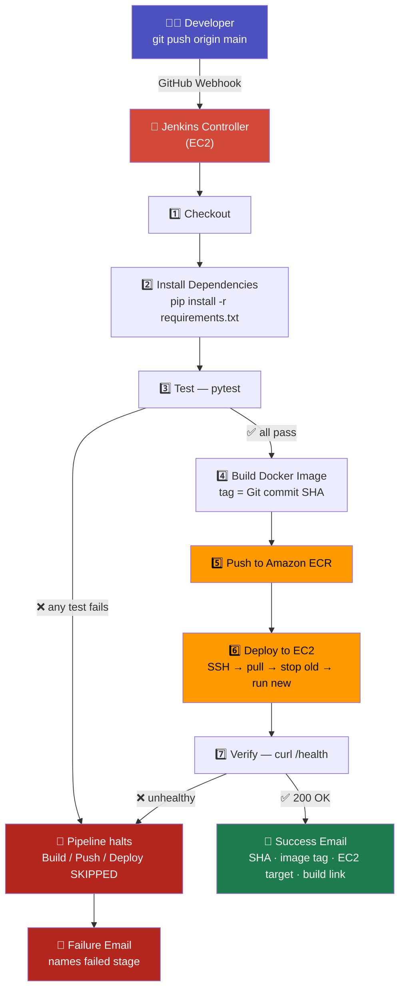
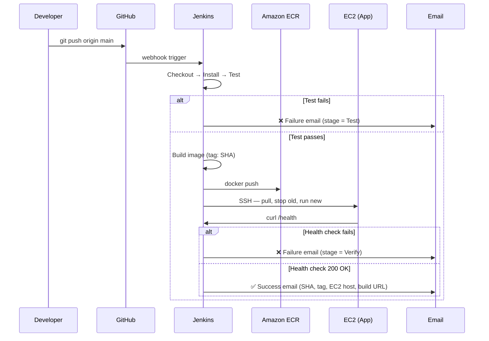

<div align="center">

# 🚀 Flask + MongoDB CI/CD Pipeline
### Jenkins → Docker → Amazon ECR → EC2 → Email Notification

**Graded Assignment — CI/CD Pipeline** · Hero Vired DevOps Program

[](#-pipeline-overview)
[](#-dockerization)
[](#-push-to-amazon-ecr)
[](#-deploy-to-ec2)
[](#-testing)

</div>


<br>

> **📌 What this repo proves:** every push to `main` is automatically tested, containerized, tagged with its Git commit SHA, pushed to a private ECR repository, deployed onto a live EC2 instance by replacing the running container, verified with a real `/health` check, and reported by a **distinct** success or failure email — with zero manual steps in between.

<br>

## 📖 Table of Contents

| | | |
|---|---|---|
| [🏗️ Architecture](#️-architecture) | [⚙️ Pipeline Stages](#️-pipeline-stages) | [☁️ AWS Setup](#️-aws-prerequisites) |
| [🐳 Dockerization](#-dockerization) | [🔐 Secrets & Credentials](#-secrets--credentials) | [📬 Email Notifications](#-email-notifications) |
| [🩺 Health Check Gate](#-health-check-verification-gate) | [🧪 Testing](#-testing) | [🖼️ Evidence / Screenshots](#️-evidence--screenshots) |
| [💻 Local Development](#-local-development-no-docker-no-aws) | [🛠️ Manual Deploy (if Jenkins is down)](#️-manual-deployment-fallback) | [✅ Rubric Compliance](#-rubric-compliance) |

<br>

👉 For quick reference, you can jump directly to the evidence section here:  [🖼️ Evidence / Screenshots](#-evidence--screenshots)

```
Evidence / Screenshots
│
├── I. Implementation Stages 🛠️
│
└── II. Testing Stages with Output 🧪
    │
    ├── Output A - Successful Pipeline Execution ✅
    │
    └── Output B - Pipeline Failing Test ❌
```

## 🏗️ Architecture



<table>
<tr><th>Component</th><th>Role</th></tr>
<tr><td><b>GitHub</b></td><td>Source control + webhook trigger on every push to <code>main</code></td></tr>
<tr><td><b>Jenkins (EC2 #1 — controller)</b></td><td>Orchestrates all 7 pipeline stages via a declarative <code>Jenkinsfile</code></td></tr>
<tr><td><b>Docker</b></td><td>Packages the Flask app into a portable, immutable image</td></tr>
<tr><td><b>Amazon ECR</b></td><td>Private registry holding every commit-SHA-tagged image</td></tr>
<tr><td><b>EC2 #2 — app target</b></td><td>Pulls the new image over SSH and runs it as the live container</td></tr>
<tr><td><b>MongoDB Atlas</b></td><td>Managed database the app connects to at runtime</td></tr>
<tr><td><b>Jenkins Email Extension</b></td><td>Sends a content-rich success/failure email on every run</td></tr>
</table>

> 💡 **Why two EC2 instances?** Keeping the Jenkins controller and the app's deploy target separate mirrors how real teams run CI/CD — the build tool and the running application never fight over the same box.

<br>

---

## ⚙️ Pipeline Stages

The `Jenkinsfile` implements these **7 stages, strictly in order** — a failure in any stage halts the pipeline immediately and skips everything after it.

| # | Stage | What happens |
|---|-------|---------------|
| 1️⃣ | **Checkout** | Pulls the latest commit from `main` |
| 2️⃣ | **Install** | `pip install -r requirements.txt` |
| 3️⃣ | **Test** 🧪 | Runs the full `pytest` suite — **hard gate**, nothing proceeds on failure |
| 4️⃣ | **Build** 🐳 | Builds the Docker image, tagged `${GIT_COMMIT}` — never just `latest` |
| 5️⃣ | **Push to ECR** ☁️ | Authenticates to AWS, pushes the SHA-tagged image |
| 6️⃣ | **Deploy to EC2** 🚀 | SSHes into the app target, pulls the new image, **stops + removes** the old container, runs the new one |
| 7️⃣ | **Verify** 🩺 | Curls `/health` on the deployed container — a crash-on-start is still reported as a **failed deployment** |



<br>

---

## ☁️ AWS Prerequisites

> These are set up **once, manually**, before the pipeline ever runs. The pipeline only deploys into infrastructure that already exists — it never provisions anything.

<table>
<tr><th>Resource</th><th>Purpose</th></tr>
<tr><td>🗂️ <b>ECR repository</b></td><td>Private registry that holds every SHA-tagged image</td></tr>
<tr><td>🖥️ <b>EC2 — <code>jenkins-controller</code></b></td><td>Runs Jenkins itself (t2/t3.medium recommended)</td></tr>
<tr><td>🖥️ <b>EC2 — <code>flask-practice-app</code></b></td><td>The live deploy target (t2/t3.micro, free-tier eligible)</td></tr>
<tr><td>🔑 <b>IAM role</b> on the app target</td><td><code>AmazonEC2ContainerRegistryReadOnly</code> — lets it pull from ECR with no stored keys</td></tr>
<tr><td>👤 <b>IAM user</b> for Jenkins</td><td>Push access to ECR, used only via Jenkins Credentials</td></tr>
<tr><td>🔒 <b>Security groups</b></td><td>See below</td></tr>
</table>

<details>
<summary>🔐 <b>Security group rules (click to expand)</b></summary>

<br>

**`jenkins-controller`**

| Type | Port | Source | Purpose |
|------|------|--------|---------|
| SSH | 22 | Your IP `/32` | Admin access |
| Custom TCP | 8080 | Your IP `/32` | Jenkins web UI |

**`flask-practice-app`**

| Type | Port | Source | Purpose |
|------|------|--------|---------|
| SSH | 22 | **`jenkins-controller`'s security group** (not `0.0.0.0/0`) | Jenkins deploys over SSH |
| Custom TCP | 5000 | `0.0.0.0/0` | Public app access |

> ⚠️ **Never leave port 22 open to `0.0.0.0/0`.** Scoping SSH to the controller's security group ID (not an IP range) is what keeps this safe regardless of where the controller is running.

</details>

<br>

---

## 🐳 Dockerization

<table>
<tr><td>

```dockerfile
FROM python:3.11-slim
WORKDIR /app

# Install dependencies first so Docker can cache this layer
COPY requirements.txt .
RUN pip install --no-cache-dir -r requirements.txt

COPY . .
EXPOSE 5000

# Gunicorn — production-grade WSGI server
CMD ["gunicorn", "--bind", "0.0.0.0:5000", "--workers", "2", "app:app"]
```

</td></tr>
</table>

**Build & smoke-test locally before it ever touches CI:**

```bash
docker build -t flask-practice:local .
docker run --rm -p 5000:5000 \
  -e MONGO_URI="mongodb+srv://<user>:<pass>@<cluster>/studentdb" \
  flask-practice:local

curl http://localhost:5000/health
# expect: {"status": "ok", "mongo": "connected"}
```

<br>

---

## 🔐 Secrets & Credentials

All sensitive values live in **Jenkins Credentials** — never in the repo, never in `.env` (only `.env.example` with placeholders is committed).

| Credential ID | Kind | Holds |
|---|---|---|
| `aws-creds` | AWS Credentials | Access Key / Secret Key for the `jenkins-cicd` IAM user |
| `ec2-ssh-key` | SSH Username with private key | `ubuntu` + the app target's private key |
| `mongo-uri` | Secret text | MongoDB Atlas connection string |
| `ecr-registry` | Secret text | `<account-id>.dkr.ecr.<region>.amazonaws.com` |
| `ecr-repo-name` | Secret text | e.g. `flask-practice` |
| `ec2-app-host` | Secret text | Public IP/DNS of the app target |
| `notify-email` | Secret text | Where success/failure emails are sent |

> 🚫 **Never do this:** commit an AWS key, SSH key, Mongo URI, or SMTP password to this repo — including inside `Jenkinsfile` itself. If it's sensitive, it belongs in Jenkins Credentials, full stop.

<br>

---

## 📬 Email Notifications

Graded separately from *"a notification exists"* — content must **differ meaningfully by outcome** with real build details, not a generic template.

<table>
<tr>
<td width="50%" valign="top">

### ✅ On Success

```
Subject: [SUCCESS] flask_Practice deployed - <SHA>

Deployment succeeded.
Branch: main
Commit SHA: <full SHA>
Image tag: <registry>/<repo>:<SHA>
EC2 target: <app host>
Run URL: <Jenkins build link>
```

</td>
<td width="50%" valign="top">

### ❌ On Failure

```
Subject: [FAILED] flask_Practice pipeline - <SHA>

Deployment failed.
Branch: main
Commit SHA: <full SHA>
Failed stage: Test / Build / Push / Deploy / Verify
Run URL: <Jenkins console log link>
```

</td>
</tr>
</table>

> 💡 `env.FAILED_STAGE` is set at the **top** of every stage, before its risky command runs — so the failure email always names the exact stage that broke, not just *"the pipeline failed."* Configured via the Jenkins **Email Extension** plugin with Gmail SMTP + an App Password (never the real account password).

<br>

---

## 🩺 Health-Check Verification Gate

```python
@app.route('/health')
def health():
    try:
        client.admin.command("ping")  # cheap, no auth required
        return jsonify(status="ok", mongo="connected"), 200
    except ConnectionFailure as e:
        return jsonify(status="error", mongo="unreachable", detail=str(e)), 503
```

The **Verify** stage curls this endpoint on the freshly-deployed container. A container that starts but then crashes — or can't reach Mongo — still fails the pipeline and triggers the failure email. `docker ps` showing "running" is **not** proof of a healthy deploy; a `200` from `/health` is.

<br>

---

## 🧪 Testing

```bash
pytest -v
```

| Test | Verifies |
|---|---|
| `test_health_ok` | `/health` responds `200` or `503` with a `status` key |
| Core route tests | Success **and** failure cases for existing app routes |

The **Test** stage is a hard gate — `pytest` failing stops the pipeline outright; **Build → Push → Deploy → Verify never run.**

<br>

---

## 🖼️ Evidence / Screenshots

##  "📜 Below are sequential screenshot evidences documenting implementation and testing."


# 🔧  $\Large{\textcolor{#87CEEB}{\textbf{ I.Implementation Stages }}}$

## 1.Forked Repo


-----------------
## 2.Performed Git Clone


----------------

## 3.Added matching pytest case 

```
# test_app.py
def test_health_ok(client):
    resp = client.get("/health")
    assert resp.status_code in (200, 503)   # route responds either way
    assert "status" in resp.get_json()


```

-------------

Dockerfile & .dockerignore

```
Dockerfile
FROM python:3.11-slim
 
WORKDIR /app
 
# Install dependencies first so Docker can cache this layer
COPY requirements.txt .
RUN pip install --no-cache-dir -r requirements.txt
 
# Now copy the rest of the app
COPY . .
 
EXPOSE 5000
 
# Gunicorn for a production-grade WSGI server instead of Flask's dev server
CMD ["gunicorn", "--bind", "0.0.0.0:5000", "--workers", "2", "app:app"]

```

-------------

.dockerignore

```
__pycache__/
*.pyc
.git
.gitignore
.env
.env.example
venv/
*.md
tests/
.pytest_cache/

```

----------

## 4.Create the ECR repository


```
1.AWS Console → search "ECR" → Elastic Container Registry.
2.Repositories → Create repository.
3.Visibility: Private. Name: flask-practice (or match your repo name).
3.Leave "Tag immutability" off during dev; scan-on-push can stay enabled — it's free and useful.
4.Create repository, then copy the URI shown

```


---------

## 5.Launch the EC2 instances 

One instance runs Jenkins itself (the controller). The other is the deployment target the app actually runs on. Launch both the same way, with different names and security groups.

----------

### Instance 1 - Jenkins-Controller instance 


------------

### Instance 2 - Flask-practice app Instance 


------------
 # 6.Installed  Docker on both instances


 ```
# Update package index
sudo apt-get update -y

# Install Docker and AWS CLI
sudo apt-get install -y docker.io awscli

# Enable and start Docker service
sudo systemctl enable docker --now

# Add the ubuntu user to the docker group (so you can run docker without sudo)
sudo usermod -aG docker ubuntu

```
-------

Java


-----

Docker

---------


----------

---------

## 7. IAM role for ECR pull (app target)
------


------


-----


-----

## 8.Created IAM user for Jenkins (push access)


-----


----


----

## 9.Install & Configure Jenkins


---


---
-----

## 10.Configure the SMTP server for emailext in Jenkins


```
Manage Jenkins → System → scroll to Extended E-mail Notification.
SMTP server: smtp.gmail.com. SMTP Port: 465. Check Use SSL.
Advanced → check Use SMTP Authentication → enter your Gmail address and the App Password from Section 9.
Default Content Type: HTML. Default Recipients: your notification email.
Save, then use the built-in "test configuration" button to confirm a test email arrives before writing the pipeline.

```

---------


----------

------


## 11.Add the webhook on GitHub

---------------------


---------
## 12. Updated the Jenkinsfile

<details>
<summary>  📄 <b>Jenkinsfile (click to expand)</b></summary>

<br>

```
pipeline {
  agent any

  environment {
    ECR_REGISTRY = credentials('ecr-registry')
    ECR_REPO     = credentials('ecr-repo-name')
    EC2_HOST     = credentials('ec2-app-host')
    MONGO_URI    = credentials('mongo-uri')
    AWS_REGION   = 'us-east-1'
    NOTIFY_EMAIL = 'shabdadhankkb@gmail.com'
    FAILED_STAGE = ''
  }

  stages {

    stage('Checkout') {
      steps {
        script { env.FAILED_STAGE = 'Checkout' }
        checkout scm
        script {
          env.IMAGE_TAG  = sh(script: 'git rev-parse --short HEAD', returnStdout: true).trim()
          env.GIT_COMMIT = sh(script: 'git rev-parse HEAD', returnStdout: true).trim()
          env.GIT_BRANCH = sh(script: 'git rev-parse --abbrev-ref HEAD', returnStdout: true).trim()
        }
      }
    }

    stage('Install dependencies') {
      steps {
        script { env.FAILED_STAGE = 'Install' }
        sh 'pip install --break-system-packages -r requirements.txt'
      }
    }

    stage('Test') {
      steps {
        script { env.FAILED_STAGE = 'Test' }
        sh 'pytest -v'
      }
    }

    stage('Build image') {
      steps {
        script {
          env.FAILED_STAGE = 'Build'
          docker.build("${ECR_REGISTRY}/${ECR_REPO}:${IMAGE_TAG}")
        }
      }
    }

    stage('Push to ECR') {
      steps {
        script {
          env.FAILED_STAGE = 'Push'
          withCredentials([[$class: 'AmazonWebServicesCredentialsBinding',
                             credentialsId: 'aws-creds']]) {
            sh """
              aws ecr get-login-password --region ${AWS_REGION} | \
                docker login --username AWS --password-stdin ${ECR_REGISTRY}
              docker push ${ECR_REGISTRY}/${ECR_REPO}:${IMAGE_TAG}
            """
          }
        }
      }
    }

    stage('Deploy to EC2') {
      steps {
        script {
          env.FAILED_STAGE = 'Deploy'
          sshagent(credentials: ['ec2-ssh-key']) {
            sh """
              ssh -o StrictHostKeyChecking=no ubuntu@${EC2_HOST} '
                aws ecr get-login-password --region ${AWS_REGION} | \
                  docker login --username AWS --password-stdin ${ECR_REGISTRY} &&
                docker pull ${ECR_REGISTRY}/${ECR_REPO}:${IMAGE_TAG} &&
                docker stop flask-app || true &&
                docker rm flask-app || true &&
                docker run -d --name flask-app --restart unless-stopped \
                  -p 5000:5000 \
                  -e MONGO_URI="${MONGO_URI}" \
                  ${ECR_REGISTRY}/${ECR_REPO}:${IMAGE_TAG}
              '
            """
          }
        }
      }
    }

    stage('Verify deployment') {
      steps {
        script {
          env.FAILED_STAGE = 'Verify'
          sh """
            for i in 1 2 3 4 5; do
              sleep 5
              STATUS=\$(curl -s -o /dev/null -w '%{http_code}' http://${EC2_HOST}:5000/health)
              if [ "\$STATUS" = "200" ]; then exit 0; fi
            done
            echo "Health check failed after 5 attempts"
            exit 1
          """
        }
      }
    }
  }

  post {
    success {
      emailext(
        subject: "✅ SUCCESS: flask_Practice #${env.BUILD_NUMBER} deployed",
        to: "${NOTIFY_EMAIL}",
        mimeType: 'text/html',
        body: """
          <h2 style='color:#1E7B4D;'>Deployment Succeeded</h2>
          <p><b>Branch:</b> ${env.GIT_BRANCH}</p>
          <p><b>Commit SHA:</b> ${env.GIT_COMMIT}</p>
          <p><b>Image Tag:</b> ${ECR_REGISTRY}/${ECR_REPO}:${IMAGE_TAG}</p>
          <p><b>EC2 Target:</b> ${EC2_HOST}</p>
          <p><b>Run URL:</b> <a href='${env.BUILD_URL}'>${env.BUILD_URL}</a></p>
        """
      )
    }
    failure {
      emailext(
        subject: "❌ FAILED: flask_Practice #${env.BUILD_NUMBER} — ${env.FAILED_STAGE} stage",
        to: "${NOTIFY_EMAIL}",
        mimeType: 'text/html',
        body: """
          <h2 style='color:#B3261E;'>Deployment Failed</h2>
          <p><b>Failed Stage:</b> ${env.FAILED_STAGE}</p>
          <p><b>Branch:</b> ${env.GIT_BRANCH}</p>
          <p><b>Commit SHA:</b> ${env.GIT_COMMIT}</p>
          <p><b>Run URL:</b> <a href='${env.BUILD_URL}console'>${env.BUILD_URL}console</a></p>
        """
      )
    }
  }
}
```


</details>

<br>


---------


# 🧪  $\Large{\textcolor{#87CEEB}{\textbf{ II.Testing Stages with output }}}$

## ✅ I have validated the pipeline for both successful and intentional failure test cases.

## i) Output  A - Successfull Pipeline Execution 
## ii) Output B - Pipeline Failing test
 
## $\Large{\textcolor{#87CEEB}{\textbf{ i. Output A }}}$ -  Successfull Pipeline Execution 

## ⬆️ 1.Code committed and pushed from VS Code to GitHub


## 2.Latest commits are propagated to the GitHub repository


## 3.GitHub Webhook confirms last delivery was successful


## 4.Verified ECR images on the application server


## 🔎 5.Confirmed ECR images via AWS Console


##  ✅ 6.Full pipeline run — all stages green


 ## 📧 7.Successful deployment notification email received
 


## 📜 8.Jenkins job console output screenshot 


##  9.Live application check

## 🌐 Application endpoint verified as reachable


## 🟢 10.Health check node successfully registered


## 📝 11.Student data added via application


## 📊 12.Verified student record persisted in MongoDB


## 🖥️ 13.Jenkins console snippet included as supporting evidence for push, deployment, and verification steps

##1.Docker Push 

Console output confirms image was pushed to ECR.


## 2.Deployment to EC2 actually replaces the running container
Console logs show the existing container was stopped, removed, and replaced with the latest image.


## 3..Deployment Verification (Health check)

Jenkins console output validates the application health endpoint returned 200 OK.


## $\Large{\textcolor{#87CEEB}{\textbf{ii.Output B }}}$  -  Pipeline Failing test


### 🛑 Intentionally broken run — pipeline stops early

 1. Set Response code to 999


 2.  ⬆️ Code committed and pushed from VS Code to GitHub


3.  Latest commits are propagated to the GitHub repository


4. GitHub Webhook confirms last delivery was successful
   


5. •  "⚠️ Jenkins job halted at the Testing stage, as shown in the screenshot below."

   

6. 📧 Failure email — correct failed-stage information


### 5. 🌐 Live application check


---

🛑 Jenkins Console snippet attached to validate failure at the Test stage
"⚠️ Jenkins console snippet highlights the invalid assertion (assert resp.status_code in == 999), aligning with our intentional failure testing."


## 💻 Local Development (No Docker, No AWS)

For quick iteration without spinning up any infrastructure:

```bash
python3 -m venv venv
source venv/bin/activate
pip install -r requirements.txt

# .env (never committed)
echo "MONGO_URI=mongodb://localhost:27017/student_db" > .env

python app.py
# → http://localhost:5000
```

<br>

---

## 🛠️ Manual Deployment (Fallback)

If Jenkins were ever unavailable, here's the exact sequence the pipeline automates — run by hand, straight from the `Jenkinsfile`:

```bash
# On the app target (flask-practice-app)
aws ecr get-login-password --region <region> | \
  docker login --username AWS --password-stdin <ecr-registry>

docker pull <ecr-registry>/<ecr-repo>:<commit-sha>

docker stop flask-app || true
docker rm flask-app || true

docker run -d --name flask-app --restart unless-stopped \
  -p 5000:5000 \
  -e MONGO_URI="<mongo-uri>" \
  <ecr-registry>/<ecr-repo>:<commit-sha>

curl http://localhost:5000/health
```

> **Why SSH instead of SSM?** Chosen for simplicity in a learning assignment — SSM adds IAM/agent setup overhead that isn't necessary here. SSH access is locked down to only the Jenkins controller's security group.

<br>

---

## ✅ Rubric Compliance

| Criterion | Weight | ✔️ Evidence in this repo |
|---|:---:|---|
| Pipeline stages present & passing in correct order (test gates build/deploy) | **25%** | `Jenkinsfile` — sequential `stages{}`, no `continue-on-error`; see [Pipeline Stages](#️-pipeline-stages) |
| Docker image built & tagged with commit SHA | **15%** | `IMAGE_TAG = "${env.GIT_COMMIT}"` in `Jenkinsfile`; see [Dockerization](#-dockerization) |
| Image successfully pushed to ECR | **10%** | `Push to ECR` stage; see [AWS Prerequisites](#️-aws-prerequisites) |
| EC2 deployment replaces the running container | **20%** | `docker stop` + `docker rm` before `docker run` in `Deploy to EC2` stage |
| Health-check step genuinely gates success/failure | **10%** | `/health` route + `Verify` stage; see [Health-Check Verification Gate](#-health-check-verification-gate) |
| Email notification — customized, correct on both outcomes | **15%** | Distinct `post { success / failure }` blocks; see [Email Notifications](#-email-notifications) |
| README documentation quality | **5%** | This file 🙂 |

<br>

<div align="center">

---

**Built for the Hero Vired DevOps Program — CI/CD Pipeline Graded Assignment**
⭐ **If this pipeline helped you understand CI/CD gating logic, consider starring the repo!** ⭐

`Flask` · `MongoDB` · `Docker` · `Jenkins` · `Amazon ECR` · `Amazon EC2`

</div>


