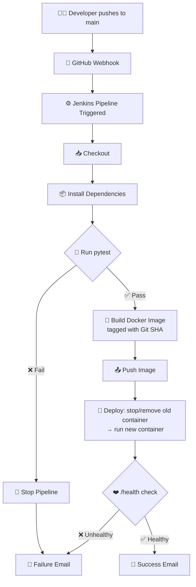

# 🚀 Flask + MongoDB CI/CD Pipeline — Jenkins Edition

**Automated test → build → deploy → verify → notify pipeline for a Python Flask application**


>  **CI/CD Pipeline**
> Built and validated end‑to‑end: source control → automated testing → containerization → deployment → health verification → email notification.

---

## 📋 Table of Contents

1. [Objective](#-objective)
2. [Architecture](#-architecture)
3. [Tech Stack](#-tech-stack)
4. [Repository Structure](#-repository-structure)
5. [Prerequisites](#-prerequisites)
6. [Getting Started](#-getting-started)
7. [Pipeline Stages](#-pipeline-stages-in-detail)
8. [Email Notifications](#-email-notifications)
9. [Secrets Management](#-secrets-management)
11. [A full pipeline run Screenshots & Evidence](#A-full-pipeline-run-Screenshots-and-Evidence) ✅
12. [Author](#-author)

---

## 🎯 Objective

This repository implements a fully automated CI/CD pipeline for a Python **Flask + MongoDB** web application. Every push to `main` triggers a Jenkins pipeline that:

- ✅ Installs dependencies and runs the **pytest** suite — a failing test **gates** the pipeline (no build/deploy happens)
- 🏗️ Builds a **Docker image**, tagged with the **Git commit SHA** (never just `latest`) for full traceability
- 📦 Publishes the image
- 🔁 **Deploys** by replacing the currently running container — not a fresh install every time
- ❤️ **Verifies** the deployment with a `/health` endpoint check — this is the true success/failure gate
- 📧 Sends a **customized email** reporting the outcome, with different content for success vs. failure

---

## 🏗️ Architecture



**Flow summary:** `Push → Checkout → Install → Test (gate) → Build (SHA‑tagged) → Push image → Deploy (swap container) → Verify (health gate) → Notify`

---

## 🧰 Tech Stack

| Layer | Technology |
|---|---|
| Application | Python 3.11, Flask |
| Database | MongoDB (Docker container) |
| Testing | pytest |
| Containerization | Docker |
| CI/CD Orchestration | Jenkins (Pipeline as Code — `Jenkinsfile`) |
| Notifications | Jenkins Email Extension (`emailext`), Gmail SMTP |
| Trigger | GitHub Webhook (`push` to `main`) |

---

## 📁 Repository Structure

```text
.
├── app.py                  # Flask application (incl. /health route)
├── test_app.py             # pytest suite — success & failure cases
├── requirements.txt        # Python dependencies
├── Dockerfile              # Container image definition
├── .dockerignore
├── Jenkinsfile             # Pipeline definition (Checkout→Notify)
├── .gitignore
└── README.md                # You are here 📍
```

---

## ✅ Prerequisites

| Requirement | Purpose |
|---|---|
| Docker installed & running | Builds and runs the application + database containers |
| Jenkins with **Docker Pipeline**, **Email Extension**, and **GitHub Integration** plugins | Runs and orchestrates the pipeline |
| A reachable Jenkins URL for the GitHub webhook | Lets GitHub trigger builds automatically on push |
| Jenkins credentials configured (see [Secrets Management](#-secrets-management)) | Keeps DB URI, SMTP, and Git tokens out of the repo |
| Gmail App Password (or your SMTP provider of choice) | Sends success/failure notification emails |

---

## 🏁 Getting Started

<table>
<tr><td>

```bash
# 1️⃣ Clone your fork
git clone https://github.com/<your-username>/flask_Practice.git
cd flask_Practice

# 2️⃣ Create a virtual environment
python3 -m venv venv
source venv/bin/activate

# 3️⃣ Install dependencies
pip install -r requirements.txt

# 4️⃣ Run the test suite locally
pytest -v

# 5️⃣ Build the Docker image
docker build -t flask-student-app:local .
```
</td></tr>
</table>
------------------


## 1.Forked Repo


-----------------
## 2.Git Clone


----------------

## 3.dded matching pytest case 

```
# test_app.py
def test_health_ok(client):
    resp = client.get("/health")
    assert resp.status_code in (200, 503)   # route responds either way
    assert "status" in resp.get_json()


```

-------------

Dockerfile & .dockerignore

```
Dockerfile
FROM python:3.11-slim
 
WORKDIR /app
 
# Install dependencies first so Docker can cache this layer
COPY requirements.txt .
RUN pip install --no-cache-dir -r requirements.txt
 
# Now copy the rest of the app
COPY . .
 
EXPOSE 5000
 
# Gunicorn for a production-grade WSGI server instead of Flask's dev server
CMD ["gunicorn", "--bind", "0.0.0.0:5000", "--workers", "2", "app:app"]

```

-------------

.dockerignore

```
__pycache__/
*.pyc
.git
.gitignore
.env
.env.example
venv/
*.md
tests/
.pytest_cache/

```

----------

## 4.Create the ECR repository


```
1.AWS Console → search "ECR" → Elastic Container Registry.
2.Repositories → Create repository.
3.Visibility: Private. Name: flask-practice (or match your repo name).
3.Leave "Tag immutability" off during dev; scan-on-push can stay enabled — it's free and useful.
4.Create repository, then copy the URI shown

```

---------

## 5.Launch the EC2 instances 

One instance runs Jenkins itself (the controller). The other is the deployment target the app actually runs on. Launch both the same way, with different names and security groups.

## 🖥️ EC2 Instances Overview

| Instance   | Name                | Type                          | Purpose                                      |
|------------|---------------------|-------------------------------|----------------------------------------------|
| Controller | jenkins-controller  | t2.medium / t3.medium         | Runs Jenkins, builds images, triggers deploys |
| App target | flask-practice-app  | t2.micro / t3.micro (free-tier eligible) | Runs the deployed Flask container |


## 🔐 Security Group Rules

| Type       | Port | Source       | Purpose                                      |
|------------|------|--------------|----------------------------------------------|
| SSH        | 22   | Your IP /32  | You SSH in to install Jenkins and troubleshoot |
| Custom TCP | 8080 | Your IP /32 (or a small trusted range) | Jenkins web UI access |

----------

Jenkins-Controller instance 


------------

Flask-practice app Instance 


------------
 # 6.Installed  Docker on both instances


 ```
# Update package index
sudo apt-get update -y

# Install Docker and AWS CLI
sudo apt-get install -y docker.io awscli

# Enable and start Docker service
sudo systemctl enable docker --now

# Add the ubuntu user to the docker group (so you can run docker without sudo)
sudo usermod -aG docker ubuntu

```
-------

Java


-----

Docker

---------


----------

---------

## IAM role for ECR pull (app target)

## 🔑 Authentication & Access Approach

| Approach                                | How it works                                                                 | Used in this guide |
|-----------------------------------------|-------------------------------------------------------------------------------|--------------------|
| EC2 instance role on `flask-practice-app` | Lets the EC2 box pull from ECR without storing AWS keys locally               | ✅ Yes — for the `docker pull` during deploy |
| IAM user + access keys (Jenkins Credentials) | Jenkins authenticates to AWS directly to push the image to ECR                | ✅ Yes — for the Build/Push stages |

------


------


-----


-----

## 7.Created IAM user for Jenkins (push access)


-----


----


----

## 8.Install & Configure Jenkins


---


---
-----

## 9.Configure the SMTP server for emailext in Jenkins


```
Manage Jenkins → System → scroll to Extended E-mail Notification.
SMTP server: smtp.gmail.com. SMTP Port: 465. Check Use SSL.
Advanced → check Use SMTP Authentication → enter your Gmail address and the App Password from Section 9.
Default Content Type: HTML. Default Recipients: your notification email.
Save, then use the built-in "test configuration" button to confirm a test email arrives before writing the pipeline.

```

---------


----------

------


## 10.Add the webhook on GitHub

---------------------


---------


---------


## ⚙️ Pipeline Stages

The `Jenkinsfile` implements these **7 stages, strictly in order** — a failure in any stage halts the pipeline immediately and skips everything after it.

| # | Stage | What happens |
|---|-------|---------------|
| 1️⃣ | **Checkout** | Pulls the latest commit from `main` |
| 2️⃣ | **Install** | `pip install -r requirements.txt` |
| 3️⃣ | **Test** 🧪 | Runs the full `pytest` suite — **hard gate**, nothing proceeds on failure |
| 4️⃣ | **Build** 🐳 | Builds the Docker image, tagged `${GIT_COMMIT}` — never just `latest` |
| 5️⃣ | **Push to ECR** ☁️ | Authenticates to AWS, pushes the SHA-tagged image |
| 6️⃣ | **Deploy to EC2** 🚀 | SSHes into the app target, pulls the new image, **stops + removes** the old container, runs the new one |
| 7️⃣ | **Verify** 🩺 | Curls `/health` on the deployed container — a crash-on-start is still reported as a **failed deployment** |


---

## 📬 Email Notifications

Graded separately from *"a notification exists"* — content must **differ meaningfully by outcome** with real build details, not a generic template.

<table>
<tr>
<td width="50%" valign="top">

### ✅ On Success

```
Subject: [SUCCESS] flask_Practice deployed - <SHA>

Deployment succeeded.
Branch: main
Commit SHA: <full SHA>
Image tag: <registry>/<repo>:<SHA>
EC2 target: <app host>
Run URL: <Jenkins build link>
```

</td>
<td width="50%" valign="top">

### ❌ On Failure

```
Subject: [FAILED] flask_Practice pipeline - <SHA>

Deployment failed.
Branch: main
Commit SHA: <full SHA>
Failed stage: Test / Build / Push / Deploy / Verify
Run URL: <Jenkins console log link>
```

</td>
</tr>
</table>

> 💡 `env.FAILED_STAGE` is set at the **top** of every stage, before its risky command runs — so the failure email always names the exact stage that broke, not just *"the pipeline failed."* Configured via the Jenkins **Email Extension** plugin with Gmail SMTP + an App Password (never the real account password).

<br>

---

## 🔐 Secrets Management

All sensitive values live in **Jenkins Credentials** — nothing is committed to the repository:


| Credential ID | Kind                  | Value                                                                 |
|---------------|-----------------------|-----------------------------------------------------------------------|
| aws-creds     | AWS Credentials       | Access Key ID / Secret Access Key from the `jenkins-cicd` IAM user     |
| ec2-ssh-key   | SSH Username + Key    | Username: `ubuntu` · Key: full contents of `flask-practice-key.pem`    |
| mongo-uri     | Secret text           | Your MongoDB Atlas connection string                                   |
| ecr-registry  | Secret text           | `<account-id>.dkr.ecr.<region>.amazonaws.com`                          |
| ecr-repo-name | Secret text           | e.g. `flask-practice`                                                  |
| ec2-app-host  | Secret text           | Public IP or DNS of `flask-practice-app`                               |
| notify-email  | Secret text           | Email address where success/failure notifications should be sent       |


---------


----------


`.env`, credentials, and keys are all listed in `.gitignore` and never appear in pipeline logs or source.

---


# 🔄  $\Large{\textcolor{#87CEEB}{\textbf{A full pipeline run Screenshots and Evidence}}}$
 
## $\Large{\textcolor{#87CEEB}{\textbf{Output A }}}$ -  Successfull Pipeline Execution 

## ⬆️ Code committed and pushed from VS Code to GitHub


## Latest commits are propagated to the GitHub repository


## GitHub Webhook confirms last delivery was successful


## Verified ECR images on the application server


## 🔎 Confirmed ECR images via AWS Console


#  ✅ Full pipeline run — all stages green


 ## 📧 Successful deployment notification email received
 


## 📜 Jenkins job console output screenshot 


##  Live application check

## 🌐 Application endpoint verified as reachable


## 🟢 Health check node successfully registered


## 📝 Student data added via application


## 📊 Verified student record persisted in MongoDB


## 🖥️ Jenkins console snippet included as supporting evidence for push, deployment, and verification steps

## Docker Push 

Console output confirms image was pushed to ECR.


## Deployment to EC2 actually replaces the running container
Console logs show the existing container was stopped, removed, and replaced with the latest image.


## Deployment Verification (Health check)

Jenkins console output validates the application health endpoint returned 200 OK.


## $\Large{\textcolor{#87CEEB}{\textbf{Output B }}}$  -  Pipeline Failing test


### 🛑 Intentionally broken run — pipeline stops early

 1. Set Response code to 999


 2.  ⬆️ Code committed and pushed from VS Code to GitHub


3.  Latest commits are propagated to the GitHub repository


4. GitHub Webhook confirms last delivery was successful
   


5. •  "⚠️ Jenkins job halted at the Testing stage, as shown in the screenshot below."

   

6. 📧 Failure email — correct failed-stage information


### 5. 🌐 Live application check


---

🛑 Jenkins Console snippet attached to validate failure at the Test stage
"⚠️ Jenkins console snippet highlights the invalid assertion (assert resp.status_code in == 999), aligning with our intentional failure testing."


## 👤 Author

Maintained as part of a graded DevOps CI/CD pipeline assignment.

**Stack:** Flask · MongoDB · Docker · Jenkins · pytest

---

<div align="center">

⭐ **If this pipeline helped you understand CI/CD gating logic, consider starring the repo!** ⭐

</div>
